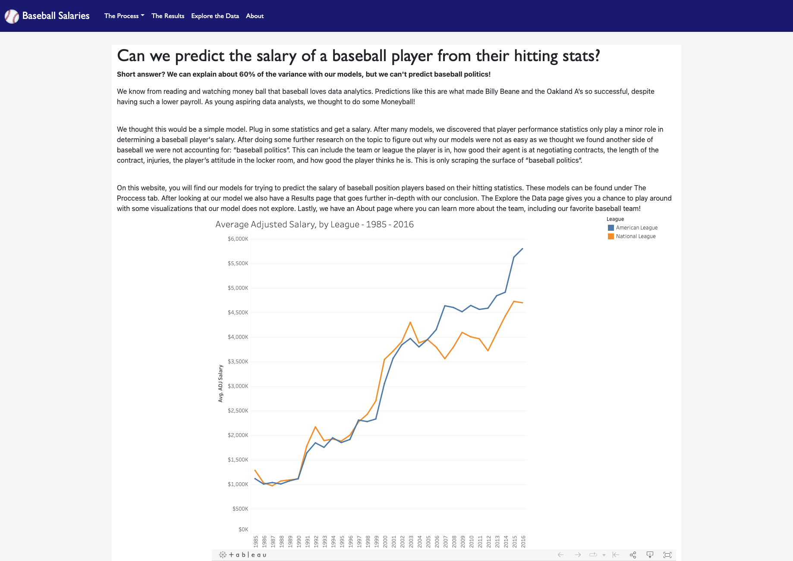

#  &nbsp; Baseball Salary Analysis
# Overview
We set out to see if we could predict what a baseball hitter's salary was based on their statistics and if there were certain statistics that were better predictors of pay. After analyzing the data and running various machine learning algorithms, we collected our findings and [published them here](https://anyren.github.io/baseball_salary_analysis/).

### Contributers (Group 6)
* William Vann
* Sarah Stoffel
* Ilia Phiranishvili
* Amanda Nyren

# update this image!

# Process

<<<<<<< Updated upstream
## Source Data
* Hitters Salaries (2.12 MB): https://www.kaggle.com/datasets/andrewdecker/hitters-salary-adjusted-to-inflation
=======

 **Instructions**

## Create Repository

 1. Create a new repository project in GitHub called *baseball_salary_analysis*. 

 2. Clone the new repository from GitHub to your computer's desktop then add your notebook files, Data file and your Flask app to the repo.  Remember to commit and push to GitHub regularly.

 ## Clean the data

 1. Open a GitBash (Window) or Terminal (Mac) to the *baseball_salary_analysis* repo.
 
 2. Change your python environment to *PythonData38* then launch Jupyter Nootebook by typing 'Jupyter Notebook' and hit Enter.
 
 3. To clean both datasets using jupyter notebook. For the ETL process, we cleaned data, and dropped columns in the dataset to remove inrrelavent information. 

 ## next step

 1. To 
 
 2. 

 4. 

 5. 

## Major Tasks:
### Data Cleanup/Processing
* Figure out what all the shorthand means
* Determine the teams from abbreviations
>>>>>>> Stashed changes

## Data Cleanup/Processing
Dataset was cleaned to remove duplicates and outliers. We then reduced the data by removing rows for the first three years of each player's career and aggregated the remaining stats. Finally, we took the natural logarithm of the adjusted salaries.

## Creating ML models
We ran the following analysis:
* Multivariate regression:
    * LinearRegression()
    * GradientBoostingRegressor()
    * RandomForestRegressor()
    * smf.ols()
* Classifiers:
    * KMeans
    * KNN 
    * RandomForest 
    * ExtraTrees 
    * Support Vector Machine(SVM)
    * Use tsne to visualize the clusters

## Analysis
The results of our models and analysis can be found on our [site](https://anyren.github.io/baseball_salary_analysis/).

## Website
The website was created using Bootstrap and HTML/CSS. There is a map on the visualization page that uses Leaflet and D3 to style and display the data. The site is hosted on Github Pages.

# Instructions
Our code was written in Python version 3.8 and requires the following packages:

* matplotlib
* numpy
* pandas
* seaborn
* scikit-learn
* statsmodels

To run, clone this repo and open a jupyter notebook server from the root location. All code for analysis is in the `Notebooks` directory. 

